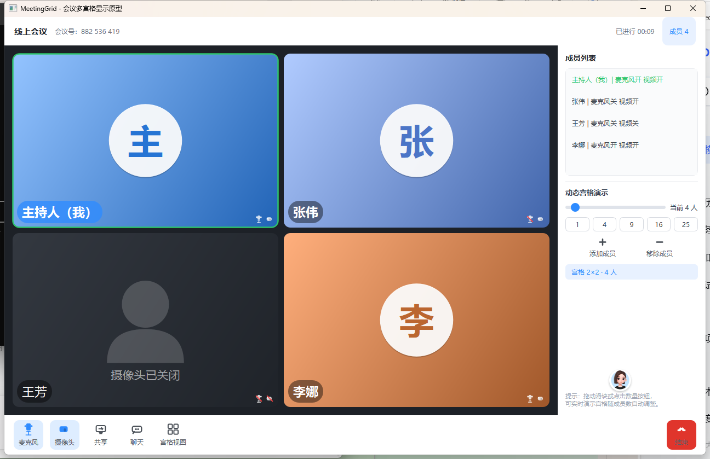

# MeetingGrid

基于 Qt 6 的会议多宫格客户端，包含 **MeetingGrid** 与 **MeetingGridServer** 两个可执行程序。

客户端按人数计算宫格行列并铺满窗口，本机接入摄像头与麦克风；服务端用 WebSocket 维护房间，控制面走 JSON，媒体面用二进制帧中继 JPEG 画面、PCM 音频和屏幕共享。



## 已实现

**宫格**

- 行列由 `列数 = ⌈√n⌉`、`行数 = ⌈n/列⌉` 算出，空位不超过一行；`GridManager` 与 UI 分离
- 宫格视图与演讲者视图切换；演讲者视图下点击宫格切换主画面
- 成员用滑块或 1/4/9/16/25 预设增减，`--members=N` 可指定启动人数

**本地媒体**

- 主持人走 `QCamera` + `QVideoSink`，设备不可用时回退到模拟画面
- 麦克风用 `QAudioSource` 采集，RMS + 滞回阈值判定说话，驱动宫格与成员列表高亮
- 摄像头/麦克风按钮真实启停；关闭后立即剪影，不留最后一帧
- 视频填充支持裁剪填充与等比缩放，可在设置里改设备与模拟帧率

**信令**

- 文本帧统一信封 `{"type":"..."}`：建会、入会、退会、麦/摄像/共享状态、聊天、`ping`/`pong`
- 房间号 9 位数字，上限 49 人；主持人离开或房间空则广播 `room_closed` 并销毁
- 超过 120 秒无消息断开；入会失败返回 `already_in_room` / `room_not_found` / `room_full` / `bad_request`
- 消息类型与字段见 [docs/信令协议.md](docs/信令协议.md)

**媒体中继**

- 二进制信封：4 字节大端 `headerLen` + UTF-8 JSON header + payload
- `video`/`screen` 为 JPEG，`audio` 为 Int16 / 44.1 kHz 单声道 PCM；服务端注入 `member_id` 后转发给同会其他人
- 单帧上限 8 MB，透传不做转码或拥塞控制

**界面**

- 无边框窗口：顶栏拖动，边缘缩放，自绘最小化/最大化/关闭
- 图标由 `QPainter` 绘制，不附带图片资源
- 可折叠聊天、会议计时、成员列表

**测试**

- `gridtest`：典型规格 + 1~100 人的格子数/行列不变量
- `signalingtest`：进程内拉起服务端与 3 个客户端，覆盖建会到关房，以及视频/音频帧透传
- `server/test/smoke_test.mjs`：对独立服务端做 17 项协议断言

## 计划中

- 用 WebRTC 替换 JPEG/PCM 中继，降低延迟
- 宫格拖动排序，以及设备与布局的本地记忆

## 构建

需要 Qt 6.5 及以上（开发环境为 Qt 6.10.3 MSVC 2022 64-bit），组件：Widgets、Multimedia、Network、WebSockets、Test。

```bash
cmake -S . -B build
cmake --build build
ctest --test-dir build --output-on-failure
```

产物为 `MeetingGrid` 与 `MeetingGridServer`。先启动服务端（默认 `0.0.0.0:8090`），再开两个客户端即可建会、入会。只看本地宫格可直接运行 `MeetingGrid --members=9`。

Windows 下若 exe 旁缺少 Qt DLL，可用仓库里的 `deploy.bat` 调用 `windeployqt`。

## 目录结构

```
src/       会议客户端
server/    信令服务端、协议常量、冒烟测试
tests/     宫格单测与信令集成测试
docs/      信令协议与运行截图
```
